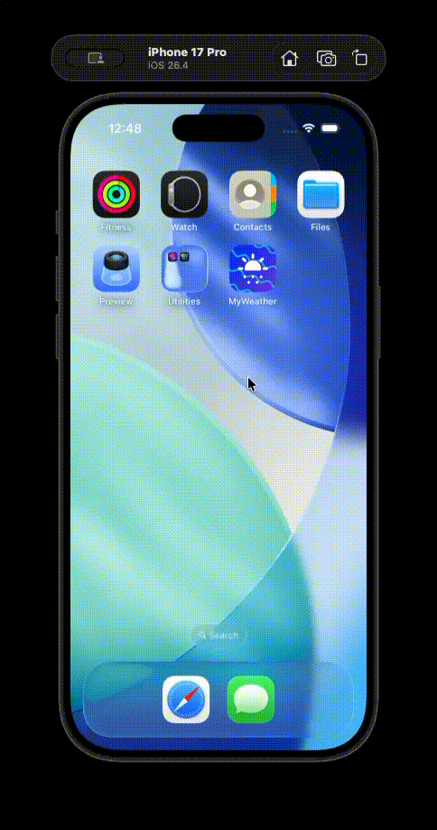

# MyWeather

MyWeather is a SwiftUI-based weather application that provides current weather information based on the user's location. The app features a launching animation, a loading view with advanced animations, and an iOS 26-inspired Liquid Glass redesign.

## Demo

## Features
- Current weather data (temperature, feels like, min/max, humidity, wind, pressure, visibility, cloudiness)
- Hourly forecast displayed as a smooth line graph
- Location-based weather using CoreLocation
- Launch animation with smooth transitions
- Loading view with animated color cycling
- **iOS 26 Liquid Glass redesign**: translucent, adaptive materials with dynamic opacity on interaction
- Dark mode support with adaptive text colors
- Smooth drag‑up card to reveal map details

## Requirements
- iOS 16.0+ (designed for iOS 26 Liquid Glass effects)
- Xcode 15.0+
- Swift 5.5+

## Installation
1. Clone the repository
2. Open the project in Xcode
3. Build and run the project on your simulator or device.

## Usage
1. On launch, the app displays a launching animation.
2. After the animation, the app requests location permissions.
3. Once the location is obtained, the app fetches the current weather data.
4. The main screen displays the temperature, wind speed, and humidity.
5. Drag the “Weather now” card upward to reveal the map and more details; the card’s glass opacity increases as you drag.
6. Scroll the hourly forecast line graph to see the temperature trend.

## Code Overview
- **LaunchView** – Displays the launching animation and transitions to `ContentView`.
- **ContentView** – Manages the display of `LaunchView` and the main weather content.
- **WeatherRow** – Displays individual weather information (temperature, wind speed, humidity).
- **LocationManager** – Handles location services and provides the user's current location.
- **WeatherManager** – Fetches weather data from the OpenWeatherMap API based on the user's location.
- **LineGraph** – Displays the hourly forecast using a smoothed line graph with Liquid Glass background.
- **Extensions.swift** – Contains `glassBackground`, `glassCard`, `elevatedGlass` view modifiers and adaptive color helpers.

## License
This project is licensed under the MIT License. See the LICENSE file for details.

## Acknowledgements
- [OpenWeatherMap API](https://openweathermap.org/api) for providing weather data.
- [SwiftUI](https://developer.apple.com/xcode/swiftui/) for the UI framework.